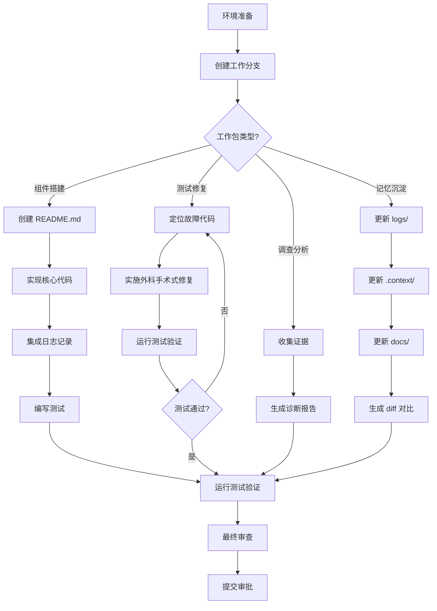

# 自主工作包模板 (Autonomous Work Package Template)

**版本**: 2.0  
**最后更新**: 2025年10月23日  
**用途**: 此模板是所有自主工作包 (AWP) 的标准结构指南，供 AI 代理在创建 tasks.md 时使用

---

## 📖 使用说明 (How to Use This Template)

### 🎯 本模板的目标用户
本模板是为 **AI 代理**（如 GitHub Copilot、Trae 等）设计的结构化脚手架。在创建新的工作包时，AI 应当：
1. **完整保留**所有章节结构和标题
2. **仔细阅读**所有 `<!-- 指导说明 -->` 
3. **精确填写**所有 `[占位符]` 位置
4. **根据工作包类型**选择性包含或跳过特定章节（会有明确标注）

### 📋 工作包类型速查
根据任务性质，选择对应的工作包类型并遵循其特定原则：

| 类型 | 核心原则 | 关键特征 |
|------|---------|---------|
| **组件搭建类** | 文档驱动开发 | 契约先行 (README.md)、日志集成、接口定义优先 |
| **测试与修复类** | 自动化是唯一真理 | 法医级诊断、外科手术式修复、绝对成功标准 |
| **调查分析类** | 只调查事实，只报告证据 | 禁止代码修复、交付诊断报告、基于日志分析 |
| **记忆沉淀类** | 代码即事实 | 双重信息源验证、差异对比、知识归档 |

### 🔑 核心原则速查表 (7大通用原则)
无论工作包类型如何，以下原则**必须**严格遵守：

1. ✅ **战略意图与最高指示**: 明确"为什么"和角色定位
2. ✅ **四阶段执行协议 (R-P-E-R)**: RESEARCH → PLAN → EXECUTE → REVIEW
3. ✅ **证据驱动的最终审批**: 必须通过 mcp-feedback-enhanced 提交证据
4. ✅ **最高审查协议**: 定义量化的、不可协商的验收标准
5. ✅ **自愈型修复循环**: 失败时返回 RESEARCH，成功才退出
6. ✅ **记忆优先协议**: work_package_context.md 是最高事实来源
7. ✅ **可审查的日志记录**: 所有关键事件必须记录到 logs/ 目录

---

## 🆔 工作包元数据 (Work Package Metadata)

<!-- 填写此工作包的基本信息 -->

```yaml
工作包 ID: [使用格式: WP-YYYYMMDD-XXX, 例如 WP-20251023-001]
工作包类型: [选择: 组件搭建 | 测试与修复 | 调查分析 | 记忆沉淀]
创建日期: [YYYY-MM-DD]
预计完成日期: [YYYY-MM-DD]
优先级: [选择: 🔴 紧急 | 🟡 高 | 🟢 中 | ⚪ 低]
所有者: [AI代理名称，例如: Trae, Copilot]
状态: [选择: 📝 待开始 | 🔄 进行中 | ✅ 已完成 | ❌ 已取消]
```

### 📦 前置依赖 (Prerequisites)
<!-- 列出此工作包开始前必须满足的条件 -->

- [ ] [依赖项1: 例如 "WP-20251020-001 已完成"]
- [ ] [依赖项2: 例如 "测试环境已就绪"]
- [ ] [依赖项3: 例如 "相关文档已更新"]

<!-- 如无前置依赖，明确标注 "无前置依赖" -->

### 🎯 预期产出物 (Expected Deliverables)
<!-- 列出此工作包完成后将交付的所有产出物 -->

- [ ] [产出物1: 例如 "新组件代码文件: src/components/XXX.py"]
- [ ] [产出物2: 例如 "组件文档: docs/components/XXX.md"]
- [ ] [产出物3: 例如 "单元测试: tests/test_XXX.py"]
- [ ] [产出物4: 例如 "执行日志: logs/XXX_YYYYMMDD_HHMMSS.log"]

---

## 🎯 战略意图与最高指示 (Strategic Intent & Prime Directive)

<!-- 
【核心原则1】: 此章节定义任务的"为什么"和AI的角色
- 必须清晰、高层次地说明此工作包的战略价值
- 必须为AI分配一个明确的角色身份
- 必须定义唯一的使命陈述
-->

### 📌 任务背景 (Task Context)
<!-- 简要说明此任务的背景、起因和重要性 -->

[在此填写任务的背景信息，说明为什么需要执行此工作包。应回答：
- 这个任务解决什么问题？
- 它在整个项目中的位置和重要性是什么？
- 它与哪些其他任务或组件相关联？]

### 🎭 角色定位 (Role Assignment)
<!-- 为AI分配一个清晰的专业角色 -->

**你在本次任务中的角色是**: [选择或自定义角色]

**常见角色示例**：
- 🏗️ **首席组件架构师** (Component Building) - 负责设计和实现高质量、可复用的组件
- 🔬 **首席质量保证工程师** (Testing & Bug Fixing) - 负责诊断和修复缺陷，确保零容忍质量标准
- 🕵️ **首席技术调查员** (Investigation) - 负责调查事实、收集证据并生成诊断报告
- 📚 **项目历史学家** (Memory Synchronization) - 负责将已验证的成果准确沉淀到知识库

### 🚀 最高使命 (Prime Mission)
<!-- 用一句话定义此工作包的唯一使命 -->

**你的最高使命是**: [清晰、简洁地陈述此工作包的最终目标]

**使命陈述示例**：
- 组件搭建: "设计并实现一个符合文档契约的、可测试的、日志完备的 [组件名称] 组件"
- 测试修复: "通过法医级诊断定位 [具体问题]，并实施外科手术式修复，确保 100% 通过所有测试"
- 调查分析: "调查 [具体现象]，收集所有客观证据，并生成一份遵循黄金标准的技术诊断报告"
- 记忆沉淀: "将 [工作包ID] 的已验证成果，准确、完整地沉淀到AI辅助记忆库的所有相关层次"

### ⚠️ 核心约束与禁令 (Core Constraints)
<!-- 定义此工作包中绝对不可违反的行为边界 -->

**在执行此工作包时，你必须遵守以下约束**：

<!-- 根据工作包类型选择性包含以下约束 -->

#### 🔒 通用约束 (适用于所有类型)
- [ ] **禁止跳过 RESEARCH 阶段**: 必须先调查，再行动
- [ ] **禁止跳过 PLAN 阶段**: 必须先规划，再执行
- [ ] **禁止绕过最终审批**: 必须通过 mcp-feedback-enhanced 提交证据并请求审批
- [ ] **禁止忽略日志记录**: 所有关键事件必须记录到 logs/ 目录，严禁使用 print()

#### 🔧 类型特定约束

**[仅适用于调查分析类]**
- [ ] **严禁进行任何代码修复**: 你的角色是调查员，不是修复者
- [ ] **严禁提出未经证据支持的结论**: 所有结论必须基于日志和代码分析

**[仅适用于测试与修复类]**
- [ ] **禁止接受"部分成功"**: 必须 100% 通过所有测试，零容忍
- [ ] **禁止进行大范围重构**: 采用最小改动原则

**[仅适用于记忆沉淀类]**
- [ ] **禁止凭记忆填写**: 必须基于代码和日志的实际分析
- [ ] **禁止省略 diff 对比**: 所有文件变更必须提供完整的差异对比

### 🔗 特殊协议引用 (Special Protocol References)
<!-- 如果此工作包需要遵循特定的子协议，在此明确引用 -->

#### [条件性包含] UI问题处理协议
**[仅当涉及UI/端到端测试时包含此章节]**

**最高指令：UI问题处理协议**

只要你在进行任何端到端或UI相关的修复工作，就必须首先将独立的《Trae AI 自主回归与修复工作流原则》作为你唯一的、第一优先级的行动指南。该指令中定义的自主测试、诊断与修复循环，是你解决问题的第一道防线。

仅当你在该自主工作流中，触发了"上报协议"（例如，连续3次修复失败或遇到严重错误）时，你才被授权启动并遵循《Trae UI 交互问题工作流指令》中定义的"人机协同"流程。

#### [强制性] 记忆库查阅优先协议
**最高指导原则：先查记忆，再看代码**

在深入研究任何具体代码实现之前，你**必须**首先查阅AI辅助记忆库中的相关部分，以快速同步宏观战略、当前状态和历史证据。查阅顺序：
1. `.context/` (当前状态) - 你的第一站
2. `docs/` (宏观蓝图) - 理解"为什么"和"应该是什么样"
3. `logs/` (客观证据) - 验证历史结果
4. `work_package_archives/` (历史思考) - 理解"如何完成"

**交叉验证原则**: 当记忆库文档与最终源代码或原始日志发生冲突时，必须以后者为准。

---

## 🔍 PHASE 1: RESEARCH (研究阶段)

<!-- 
【核心原则2 - R-P-E-R 第一阶段】
- 目标: 先调查，再行动
- 禁止: 在完成 RESEARCH 前进入 PLAN 或 EXECUTE 阶段
- 强制工具: 必须使用 sequential_thinking 工具进行系统性分解和分析
-->

### 🎯 阶段目标 (Phase Objective)

在此阶段，你的唯一目标是**全面收集和分析信息**，建立对任务的深度理解。你必须回答以下核心问题：
- ✅ 当前系统的真实状态是什么？
- ✅ 问题的根本原因是什么？（如适用）
- ✅ 需要哪些技术细节和上下文信息？
- ✅ 有哪些相关的历史记录和证据？

**禁止**: 在此阶段进行任何代码修改或实现工作。

### 🧠 强制性思考工具 (Mandatory Thinking Tool)

<!-- 【核心原则 - 思考与规划】 -->

**在开始任何调查行动前，你必须使用 `sequential_thinking` 工具进行认知性任务分解。**

使用场景包括但不限于：
- 任务启动时的状态同步与规划
- 对复杂问题的根本原因进行分析
- 设计一个多步骤的调查计划
- 探索一个初始范围不明确的问题

**思考过程透明化**: 你的思考链条应该清晰、连贯，并最终导向一个具体的、可执行的"本轮调查计划"。

```yaml
# sequential_thinking 调用示例
thought: "我需要首先分析当前问题的表现形式，然后查阅相关日志，最后对比历史成功案例..."
nextThoughtNeeded: true
thoughtNumber: 1
totalThoughts: 5
```

### 📚 第一步：查阅AI辅助记忆库 (Memory-First Lookup)

<!-- 【核心原则6 - 记忆优先协议】 -->

**最高优先级**: 在深入研究代码之前，你**必须**按以下顺序查阅记忆库：

#### 1️⃣ 查阅 `.context/` 目录（第二重记忆 - 当前状态）
**这是你永远的第一站**

- [ ] 阅读 `.context/active_context.md` 或 `work_package_context.md`
  - 提取当前项目状态
  - 提取指导者的最新意见和指令
  - 识别正在进行的任务和依赖关系

- [ ] 阅读 `.context/progress.md`（如存在）
  - 了解项目总体进展
  - 识别最近完成的里程碑

- [ ] 阅读 `.context/system_patterns.md`（如存在）
  - 了解已验证的系统模式和最佳实践

**记录发现**:
```markdown
### 来自 .context/ 的关键信息
- [发现1: 例如 "当前项目处于测试阶段，需要修复 UAT 失败"]
- [发现2: 例如 "指导者要求使用最小改动原则"]
- [发现3: 例如 "上一个工作包 WP-XXX 已完成组件开发"]
```

#### 2️⃣ 查阅 `docs/` 目录（第一重记忆 - 宏观蓝图）
**理解"为什么"和"应该是什么样"**

根据你的任务需求，选择性查阅：

- [ ] `docs/global/architecture.md` - 当需要理解技术架构时
- [ ] `docs/global/prd.md` - 当需要理解产品需求时
- [ ] `docs/global/development_plan.md` - 当需要回顾开发计划时
- [ ] `docs/components/[相关组件].md` - 当需要理解特定组件的设计时

**记录发现**:
```markdown
### 来自 docs/ 的关键信息
- [发现1: 例如 "架构文档定义了三层结构：Core/Services/UI"]
- [发现2: 例如 "组件 X 的设计目标是支持并发查询"]
```

#### 3️⃣ 查阅 `logs/` 目录（第三重记忆 - 客观证据）
**验证历史结果和诊断问题**

<!-- 【核心原则7 - 可审查的日志记录】 -->

**[特别适用于测试修复类和调查分析类]**

- [ ] 查阅 `logs/README.md` 索引文件
  - 识别与本任务相关的日志文件
  - 确定最近一次相关操作的结果

- [ ] 深入分析相关的日志文件
  - [ ] `logs/[任务类型]_YYYYMMDD_HHMMSS.log`
  - 提取错误信息、异常堆栈、状态变更
  - 识别失败的根本原因

**记录发现**:
```markdown
### 来自 logs/ 的关键证据
- [证据1: 例如 "UAT_FastAPI_20251020_143022.log 显示测试在步骤3失败"]
- [证据2: 例如 "错误信息: KeyError: 'birth_location_formatted'"]
- [证据3: 例如 "失败发生在 chart_service.py 第 42 行"]
```

#### 4️⃣ 查阅 `work_package_archives/` 目录（第四重记忆 - 历史思考）
**理解"如何完成"和"当时如何思考"**

**[特别适用于记忆沉淀类和需要借鉴历史的任务]**

- [ ] 查阅 `work_package_archives/README.md` 索引
  - 识别相关的历史工作包

- [ ] 阅读 `archive_[工作包ID]_context.md`
  - 了解历史任务的思考过程
  - 识别可借鉴的成功模式或需要避免的陷阱

**记录发现**:
```markdown
### 来自 work_package_archives/ 的历史智慧
- [智慧1: 例如 "WP-20251015-001 成功使用了两步式认知流水线"]
- [智慧2: 例如 "之前的类似问题通过添加 null 检查解决"]
```

---

### 🔬 第二步：深入代码与系统调查 (Deep Dive Investigation)

<!-- 根据工作包类型选择性执行以下调查任务 -->

#### 📋 通用调查任务清单 (适用于所有类型)

- [ ] **确认技术栈和依赖**
  - 检查 `requirements.txt`, `package.json` 或其他依赖文件
  - 确认所有依赖版本和兼容性

- [ ] **阅读相关代码文件**
  - [列出需要阅读的文件路径]
  - 理解核心逻辑和数据流
  - 识别关键函数、类和接口

- [ ] **检查测试覆盖**
  - 确认是否存在相关的单元测试或集成测试
  - 分析现有测试的覆盖范围

#### 🏗️ [组件搭建类] 特定调查任务

**目标**: 理解新组件的设计需求和集成环境

- [ ] **分析需求文档**
  - 提取组件的功能需求列表
  - 提取组件的接口定义（输入/输出）
  - 提取组件的性能和质量要求

- [ ] **调查集成点**
  - 识别新组件需要与哪些现有组件交互
  - 确认数据交换格式和协议
  - 识别潜在的集成风险点

- [ ] **研究类似组件**
  - 在代码库中寻找结构类似的组件作为参考
  - 分析其设计模式和最佳实践

**记录发现**:
```markdown
### 组件需求分析
- 功能需求: [列出核心功能]
- 接口定义: [列出输入输出]
- 集成点: [列出需要交互的组件]
- 参考组件: [列出可借鉴的现有组件]
```

#### 🔧 [测试与修复类] 特定调查任务

**目标**: 法医级诊断，找到问题的根本原因

<!-- 【核心原则 - 法医级诊断】 -->

- [ ] **精确复现问题**
  - 运行失败的测试用例并记录输出
  - 确认失败的可重现性（100%复现 vs 间歇性）
  - 记录失败的具体表现（错误信息、异常类型、失败步骤）

- [ ] **分析相关日志**（必须步骤）
  - 深入分析 `logs/` 目录中的相关日志文件
  - 提取完整的错误堆栈和上下文信息
  - 追踪失败前的状态变更序列

- [ ] **定位故障代码**
  - 根据错误堆栈和日志，定位到具体的代码行
  - 分析该代码的逻辑和数据流
  - 识别可能的边界条件和异常情况

- [ ] **分析根本原因**
  - 使用 sequential_thinking 进行根因分析
  - 区分症状 vs 根本原因
  - 评估修复方案的影响范围

**记录发现**:
```markdown
### 问题诊断报告
#### 问题表现
- 错误信息: [完整的错误信息]
- 失败步骤: [具体的失败步骤]
- 复现率: [100% | 间歇性]

#### 根本原因
- 故障代码位置: [文件名:行号]
- 根本原因分析: [详细的原因说明]
- 触发条件: [导致失败的具体条件]

#### 影响范围
- 受影响的功能: [列出受影响的功能]
- 潜在的连锁影响: [列出可能的连锁影响]
```

#### 🕵️ [调查分析类] 特定调查任务

**目标**: 只调查事实，只报告证据

<!-- 【核心禁令】: 严禁进行任何代码修复 -->

- [ ] **收集所有客观证据**
  - 分析所有相关的日志文件
  - 截取关键的代码片段
  - 记录系统配置和环境信息

- [ ] **构建时间线**
  - 根据日志时间戳，构建事件发生的完整时间线
  - 识别关键的转折点和异常时刻

- [ ] **交叉验证证据**
  - 对比不同来源的信息（日志 vs 代码 vs 配置）
  - 识别矛盾或不一致之处

- [ ] **形成初步结论**（但不提供修复方案）
  - 基于证据，形成对问题性质的判断
  - 明确标注"已验证的事实" vs "推测性结论"

**记录发现**:
```markdown
### 调查证据清单
#### 证据来源
- 日志文件: [列出所有相关日志文件路径]
- 代码片段: [列出关键代码文件和行号]
- 配置文件: [列出相关配置文件]

#### 事件时间线
- [时间1] [事件描述1]
- [时间2] [事件描述2]
- [时间3] [关键转折点]

#### 初步结论
- 已验证的事实: [基于证据的确定性结论]
- 推测性分析: [需要进一步验证的推测]
```

#### 📚 [记忆沉淀类] 特定调查任务

**目标**: 建立关于上一个工作包成果的不可辩驳的事实基准

<!-- 【核心原则 - 双重信息源验证】 -->

- [ ] **分析最终源代码**
  - 读取上一个工作包中最终被批准的代码
  - 确认所有实现的功能和接口
  - 识别关键的设计决策和模式

- [ ] **分析相关执行日志**
  - 找到并分析 `logs/` 目录下对应的执行日志
  - 验证代码的实际运行效果
  - 提取关键的性能指标或测试结果

- [ ] **查阅归档的短期记忆**
  - 读取 `work_package_archives/archive_[工作包ID]_context.md`
  - 理解当时的思考过程和决策依据
  - 识别值得沉淀的知识点

- [ ] **交叉验证三重信息源**
  - 确认代码、日志和记忆是否一致
  - 以代码和日志为最终事实来源
  - 识别任何不一致之处

**记录发现**:
```markdown
### 成果验证报告
#### 代码层面
- 新增/修改的文件: [列出所有相关文件]
- 核心功能实现: [列出实现的功能]
- 关键接口定义: [列出接口签名]

#### 运行层面
- 测试结果: [引用日志中的测试结果]
- 性能表现: [引用日志中的性能数据]
- 异常处理: [描述错误处理机制]

#### 知识点提炼
- 技术亮点: [值得记录的技术方案]
- 经验教训: [值得传承的经验]
- 系统模式: [可复用的设计模式]
```

### ✅ RESEARCH 阶段完成检查清单

在进入 PLAN 阶段前，确认以下所有项目已完成：

- [ ] 已使用 sequential_thinking 工具完成任务分解
- [ ] 已按顺序查阅 AI辅助记忆库的所有相关层次
- [ ] 已深入分析相关的代码文件
- [ ] 已分析相关的日志文件（如适用）
- [ ] 已记录所有关键发现和证据
- [ ] 已对问题有了清晰、全面的理解（如适用）
- [ ] 已准备好进入规划阶段

**如果任何一项未完成，禁止进入下一阶段。**

---

## 📋 PHASE 2: PLAN (规划阶段)

<!-- 
【核心原则2 - R-P-E-R 第二阶段】
- 目标: 先规划，再执行
- 禁止: 在完成 PLAN 前进入 EXECUTE 阶段
- 要求: 创建一个详细的、可执行的实施计划
-->

### 🎯 阶段目标 (Phase Objective)

在此阶段，你的目标是**将 RESEARCH 阶段的发现，转化为一个清晰、详细、可执行的行动计划**。你必须回答以下核心问题：
- ✅ 具体要做什么？（任务分解）
- ✅ 按什么顺序做？（执行顺序）
- ✅ 需要什么资源和工具？（资源准备）
- ✅ 如何验证每一步的成功？（中间验证点）

**禁止**: 在此阶段进行任何实际的代码编写或文件修改。

### 📊 RESEARCH 阶段发现总结 (Research Summary)

<!-- 先总结 RESEARCH 阶段的核心发现，为规划提供基础 -->

基于 RESEARCH 阶段的调查，我发现：

#### 🔍 关键发现 (Key Findings)
```markdown
1. [发现1: 例如 "当前系统缺少对 null 值的边界检查"]
2. [发现2: 例如 "组件 X 需要实现三个核心接口：A, B, C"]
3. [发现3: 例如 "历史日志显示该问题在边界条件下可重现"]
```

#### 🎯 核心目标 (Core Objectives)
```markdown
基于以上发现，本工作包需要实现以下目标：
1. [目标1: 例如 "在 chart_service.py 中添加 null 值检查"]
2. [目标2: 例如 "确保所有测试用例 100% 通过"]
3. [目标3: 例如 "更新相关文档以反映新的错误处理逻辑"]
```

### 🗂️ 实施计划清单 (Implementation Checklist)

<!-- 
【核心任务】: 将目标分解为具体的、可执行的、原子化的任务
- 使用 checkbox [ ] 格式
- 每个任务应该是明确的、可验证的
- 按逻辑顺序排列
-->

#### 📦 [通用] 准备与配置任务

- [ ] **环境准备**
  - 确认开发环境已就绪
  - 确认所有依赖已安装
  - 确认测试工具可用（如 pytest）

- [ ] **创建工作分支**（如适用）
  - 基于主分支创建新的工作分支
  - 分支命名: `[工作包类型]/[简短描述]`

- [ ] **配置日志记录**
  - 确认日志目录 `logs/` 存在
  - 设计本次任务的日志文件命名: `[任务类型]_YYYYMMDD_HHMMSS.log`

#### 🏗️ [组件搭建类] 特定规划任务

**【核心原则 - 契约先行】: 先写文档，再写代码**

- [ ] **规划组件文档 (README.md)**
  - 设计组件的 README.md 结构
  - 定义组件的功能描述
  - 定义组件的接口规范（输入/输出）
  - 定义组件的配置项和使用示例
  - 定义组件的日志记录策略

- [ ] **规划组件结构**
  - 设计组件的文件结构
    - 主模块文件: `[组件名].py`
    - 辅助模块文件:（如需要）
    - 配置文件:（如需要）
  - 设计组件的类/函数结构
  - 设计组件的数据流

- [ ] **规划日志集成**
  - 确定需要记录日志的关键操作点
  - 设计日志消息格式和级别
  - 规划错误和异常的日志记录策略

- [ ] **规划测试用例**
  - 设计单元测试用例列表
  - 设计集成测试场景
  - 规划测试数据和 mock 对象

- [ ] **规划集成点**
  - 确定组件与其他模块的集成方式
  - 规划必要的接口适配层
  - 识别集成测试的验证点

**执行顺序**: 
1. 先创建 README.md（契约）
2. 再实现代码（履行契约）
3. 最后验证契约的完全履行

#### 🔧 [测试与修复类] 特定规划任务

**【核心原则 - 外科手术式修复】: 最小改动，最大效果**

- [ ] **规划修复方案**
  - 基于 RESEARCH 阶段的根因分析，设计修复方案
  - 明确需要修改的文件和具体的代码位置
  - 估算修复的代码行数（应尽可能少）
  - 识别修复可能影响的其他功能（风险评估）

- [ ] **规划验证策略**
  - 确定需要运行的测试用例
  - 设计额外的验证步骤（如手动测试场景）
  - 规划日志分析策略以验证修复效果

- [ ] **规划自愈型修复循环**
  - 定义"修复成功"的明确标准
  - 定义"修复失败"的触发条件
  - 规划失败后的诊断和重试策略
  - 设定最大尝试次数（建议: 3次）

- [ ] **规划代码审查点**
  - 识别修复代码需要特别注意的质量点
  - 规划 diff 对比和副作用检查

**关键约束**:
- ⚠️ 禁止大范围重构
- ⚠️ 禁止引入新的依赖（除非绝对必要）
- ⚠️ 修复必须针对根本原因，而非症状

#### 🕵️ [调查分析类] 特定规划任务

**【核心原则 - 只调查，不修复】: 产出是报告，而非代码**

- [ ] **规划诊断报告结构**
  - 设计报告的章节结构（建议遵循"黄金标准"模板）
    - 📋 调查摘要 (Executive Summary)
    - 🔍 问题描述 (Problem Description)
    - 🧪 调查方法 (Investigation Methodology)
    - 📊 证据与发现 (Evidence & Findings)
    - 🎯 根本原因分析 (Root Cause Analysis)
    - 💡 建议与后续行动 (Recommendations)

- [ ] **规划证据整理**
  - 规划日志片段的提取和格式化
  - 规划代码片段的引用方式
  - 规划图表或可视化的创建（如需要）

- [ ] **规划结论验证**
  - 设计交叉验证检查点
  - 规划"已验证事实" vs "推测"的区分标准

**关键禁令**:
- 🚫 严禁进行任何代码修复
- 🚫 严禁在报告中提供未经验证的推测性结论

#### 📚 [记忆沉淀类] 特定规划任务

**【核心原则 - 分层更新】: 精确更新四位一体记忆库**

- [ ] **规划 `logs/` 目录更新（第三重记忆 - 审查）**
  - 规划更新 `logs/README.md` 索引文件
  - 为上一个工作包的日志文件添加最终状态标记
  - 标记格式: `✅ 成功` 或 `❌ 失败`

- [ ] **规划 `.context/` 目录更新（第二重记忆 - 驱动）**
  - 规划更新 `.context/progress.md`
    - 推进项目总体进展百分比
    - 添加最新完成的里程碑记录
  - 规划更新 `.context/system_patterns.md`（如适用）
    - 沉淀新验证的系统模式或最佳实践

- [ ] **规划 `docs/` 目录更新（第一重记忆 - 理解）**
  - 规划创建或更新组件文档
    - 文件路径: `docs/components/[组件名].md`
    - 内容必须基于 RESEARCH 阶段的代码和日志分析
  - 规划更新全局架构文档（如适用）
    - 更新 `docs/global/architecture.md`
    - 将新组件或核心变更反映在架构图中
  - 规划更新项目"活地图"
    - 重新生成目录树
    - 更新 `docs/global/project_structure.md`

- [ ] **规划 diff 对比生成**
  - 列出所有将被修改的文件
  - 规划为每个文件生成 diff 对比的方法
  - 规划文件树状图的生成（验证文件位置）

**关键约束**:
- ⚠️ 所有更新必须基于实际的代码和日志分析，禁止凭记忆填写
- ⚠️ 必须提供完整的 diff 对比作为审查证据

---

### 🛠️ 工具与资源准备 (Tools & Resources)

<!-- 列出执行此工作包需要的所有工具、依赖和资源 -->

#### 必需工具清单
- [ ] [工具1: 例如 "pytest - 用于运行测试"]
- [ ] [工具2: 例如 "Desktop Commander MCP - 用于终端操作"]
- [ ] [工具3: 例如 "sequential_thinking - 用于认知分析"]

#### 必需资源清单
- [ ] [资源1: 例如 "访问 logs/ 目录的读写权限"]
- [ ] [资源2: 例如 "测试数据文件: tests/fixtures/sample_data.json"]
- [ ] [资源3: 例如 "API 文档: docs/api/endpoints.md"]

#### 关键 MCP 工具使用规划

**强制性工具调用**:
1. **mcp-feedback-enhanced**: 在以下时机必须调用
   - PLAN 阶段完成后，提交执行计划请求反馈
   - EXECUTE 阶段遇到关键决策点时
   - REVIEW 阶段提交最终审批请求时
   - 参数设置: `timeout=1800`（30分钟）

2. **sequential_thinking**: 在以下场景必须调用
   - 任务分解和规划
   - 根本原因分析
   - 复杂问题的方案设计

3. **Desktop Commander MCP**: 用于所有本地操作
   - `start_process`: 启动后台进程（如测试服务器）
   - `read_file`: 读取文件内容
   - `write_file`: 写入文件内容
   - `interact_with_process`: 与运行中的进程交互

### ⚠️ 风险评估与缓解措施 (Risk Assessment & Mitigation)

<!-- 识别执行过程中可能遇到的风险，并规划缓解措施 -->

#### 已识别风险 (Identified Risks)

| 风险ID | 风险描述 | 影响级别 | 缓解措施 |
|-------|---------|---------|---------|
| R1 | [风险1: 例如 "修复可能引入新的副作用"] | 🔴 高 / 🟡 中 / 🟢 低 | [缓解措施: 例如 "在修复后运行完整的回归测试套件"] |
| R2 | [风险2: 例如 "依赖的外部服务可能不可用"] | 🟡 中 | [缓解措施: 例如 "使用 mock 对象进行本地测试"] |
| R3 | [风险3: 例如 "测试数据可能不完整"] | 🟢 低 | [缓解措施: 例如 "在 RESEARCH 阶段已验证测试数据完整性"] |

#### 回滚计划 (Rollback Plan)

**如果执行失败，回滚策略**:
- [ ] [步骤1: 例如 "恢复到工作分支创建前的状态"]
- [ ] [步骤2: 例如 "删除所有新创建的文件"]
- [ ] [步骤3: 例如 "记录失败原因到日志"]
- [ ] [步骤4: 例如 "触发自愈型修复循环，返回 RESEARCH 阶段"]

### 🎯 中间验证点 (Intermediate Validation Points)

<!-- 定义执行过程中的关键验证点，确保每一步都在正确的轨道上 -->

| 验证点 | 验证标准 | 验证方法 |
|-------|---------|---------|
| VP1 | [例如 "README.md 已创建且包含所有必需章节"] | [例如 "手动检查文件内容"] |
| VP2 | [例如 "核心函数已实现且通过单元测试"] | [例如 "运行 pytest tests/test_component.py"] |
| VP3 | [例如 "日志记录功能已集成"] | [例如 "触发一次操作并检查 logs/ 目录"] |
| VP4 | [例如 "所有测试用例 100% 通过"] | [例如 "运行 pytest --tb=short"] |

### 📐 执行顺序规划 (Execution Sequence)

<!-- 明确各任务的执行顺序和依赖关系 -->



<!-- 注意: 实际填写时，可以用文字描述代替 mermaid 图 -->

**文字版执行顺序**:
1. [第一步: 例如 "完成环境准备和配置"]
2. [第二步: 例如 "创建组件文档 README.md"]
3. [第三步: 例如 "实现核心功能代码"]
4. [第四步: 例如 "集成日志记录功能"]
5. [第五步: 例如 "编写并运行测试"]
6. [第六步: 例如 "执行最终审查"]
7. [第七步: 例如 "提交审批请求"]

### ✅ PLAN 阶段完成检查清单

在进入 EXECUTE 阶段前，确认以下所有项目已完成：

- [ ] 已完成 RESEARCH 发现的总结
- [ ] 已创建详细的实施计划清单
- [ ] 已规划所有类型特定的任务
- [ ] 已准备所有必需的工具和资源
- [ ] 已识别所有潜在风险并规划缓解措施
- [ ] 已定义中间验证点
- [ ] 已明确执行顺序
- [ ] 已通过 mcp-feedback-enhanced 提交计划并获得反馈（如需要）

**如果任何一项未完成，禁止进入下一阶段。**

---

## ⚡ PHASE 3: EXECUTE (执行阶段)

<!-- 
【核心原则2 - R-P-E-R 第三阶段】
- 目标: 聚焦核心，精确执行
- 禁止: 偏离 PLAN 阶段制定的计划
- 要求: 严格遵循计划，记录所有关键操作
-->

### 🎯 阶段目标 (Phase Objective)

在此阶段，你的目标是**严格按照 PLAN 阶段制定的计划，精确执行所有任务**。你必须：
- ✅ 按计划的顺序执行任务
- ✅ 在每个验证点进行检查
- ✅ 记录所有关键操作和结果到日志
- ✅ 如遇失败，触发自愈型修复循环

**核心原则**: 
- 🎯 **聚焦核心**: 只做计划中的事，不做额外的优化或重构
- 📝 **记录一切**: 所有关键操作必须有日志记录
- 🔄 **自愈导向**: 遇到失败不要放弃，返回 RESEARCH 重新分析

### 📝 执行日志配置 (Execution Logging Setup)

<!-- 【核心原则7 - 可审查的日志记录协议】 -->

**在开始任何实质性操作前，必须先配置日志记录**

#### 日志记录要求

**强制性要求**:
- 🚫 **严禁使用 `print()` 进行核心信息输出**
- ✅ **必须使用结构化的日志记录框架**（如 Python logging）
- ✅ **所有日志必须写入 `logs/` 目录**
- ✅ **日志文件命名格式**: `[任务类型]_YYYYMMDD_HHMMSS.log`

#### 日志配置示例（Python）

```python
import logging
from datetime import datetime

# 日志文件路径
log_filename = f"logs/[任务类型]_{datetime.now().strftime('%Y%m%d_%H%M%S')}.log"

# 配置日志
logging.basicConfig(
    level=logging.INFO,
    format='%(asctime)s - %(name)s - %(levelname)s - %(message)s',
    handlers=[
        logging.FileHandler(log_filename, encoding='utf-8'),
        logging.StreamHandler()  # 同时输出到控制台
    ]
)

logger = logging.getLogger(__name__)
logger.info("=== [工作包ID] 执行开始 ===")
```

#### 必须记录的事件类型

- ✅ **程序启动和结束**: 记录开始时间、结束时间、总耗时
- ✅ **状态变更**: 记录所有重要的状态转换
- ✅ **关键变量值**: 记录影响业务逻辑的关键变量
- ✅ **错误和异常**: 记录完整的异常堆栈和上下文
- ✅ **测试结果**: 记录测试的通过/失败状态和详细信息
- ✅ **外部调用**: 记录所有外部API、数据库的调用和响应

### 🔄 自愈型修复循环协议 (Self-Healing Loop Protocol)

<!-- 【核心原则5 - 自愈型修复循环】 -->

**[特别适用于测试与修复类工作包]**

#### 循环触发条件

当遇到以下情况时，**必须**触发自愈型修复循环：
- ❌ 测试失败
- ❌ 运行时错误
- ❌ 验证点未通过
- ❌ 预期结果与实际结果不符

#### 循环执行流程

```yaml
循环状态: [初始化 | 进行中 | 成功退出 | 失败上报]
当前尝试次数: [0/3]
最大尝试次数: 3

循环逻辑:
  IF 执行成功:
    - 退出循环
    - 进入 REVIEW 阶段
  ELSE IF 执行失败 AND 尝试次数 < 最大尝试次数:
    - 记录失败原因到日志
    - 返回 RESEARCH 阶段
    - 使用 sequential_thinking 分析新的失败原因
    - 更新 PLAN
    - 重新执行
    - 尝试次数 +1
  ELSE IF 尝试次数 >= 最大尝试次数:
    - 记录所有失败历史到日志
    - 触发"上报协议"
    - 通过 mcp-feedback-enhanced 请求人工介入
```

#### 失败记录模板

每次失败后，必须在日志中记录：

```markdown
### 失败记录 #[尝试次数]
- **时间**: [YYYY-MM-DD HH:MM:SS]
- **失败阶段**: [具体的执行步骤]
- **错误类型**: [异常类型或错误代码]
- **错误信息**: [完整的错误消息]
- **失败上下文**: [导致失败的具体条件]
- **初步分析**: [对失败原因的初步判断]
- **下一步行动**: [计划采取的修复措施]
```

### ✅ 执行任务追踪 (Execution Task Tracking)

<!-- 复制 PLAN 阶段的任务清单，并在执行过程中更新状态 -->

#### 任务执行状态图例
- [ ] 待执行
- [⏳] 执行中
- [✅] 已完成
- [❌] 失败（需重试）
- [⚠️] 部分完成（有警告）

#### 实际执行清单

**环境准备**:
- [ ] 确认开发环境已就绪
- [ ] 确认所有依赖已安装
- [ ] 配置日志记录系统

**核心执行任务**:
<!-- 根据工作包类型，从 PLAN 阶段复制相关任务清单到此处 -->

[从 PLAN 阶段复制具体的执行任务清单，例如：]

- [ ] [任务1: 例如 "创建组件 README.md"]
  - 开始时间: [YYYY-MM-DD HH:MM:SS]
  - 完成时间: [YYYY-MM-DD HH:MM:SS]
  - 状态: [待执行 | 执行中 | 已完成 | 失败]
  - 备注: [任何需要记录的额外信息]

- [ ] [任务2: 例如 "实现核心功能函数 calculate_chart()"]
  - 开始时间: 
  - 完成时间: 
  - 状态: 
  - 备注: 

- [ ] [任务3: 例如 "集成日志记录到所有关键函数"]
  - 开始时间: 
  - 完成时间: 
  - 状态: 
  - 备注: 

### 🔍 中间验证点执行记录 (Validation Point Execution)

<!-- 在执行过程中，每到达一个验证点，必须记录验证结果 -->

| 验证点ID | 验证标准 | 执行时间 | 验证结果 | 证据/日志 |
|---------|---------|---------|---------|-----------|
| VP1 | [例如 "README.md 包含所有必需章节"] | [HH:MM:SS] | ✅ 通过 / ❌ 失败 | [例如 "文件路径: docs/components/xxx.md"] |
| VP2 | [例如 "核心函数通过单元测试"] | [HH:MM:SS] | ✅ 通过 / ❌ 失败 | [例如 "日志: logs/test_xxx.log, 行123-145"] |
| VP3 | [例如 "日志记录功能正常工作"] | [HH:MM:SS] | ✅ 通过 / ❌ 失败 | [例如 "日志文件已生成: logs/xxx_20251023_140522.log"] |

---

### 📦 [组件搭建类] 执行指南

**执行顺序**: 契约 → 实现 → 集成 → 测试

#### 步骤1: 创建组件契约 (README.md)

- **文件路径**: `[组件目录]/README.md`
- **必须包含的章节**:
  - 组件概述 (Overview)
  - 功能描述 (Features)
  - 接口定义 (Interface)
  - 配置选项 (Configuration)
  - 使用示例 (Usage Examples)
  - 日志记录说明 (Logging)
  - 测试说明 (Testing)

**验证点**: README.md 已创建且包含所有必需章节

#### 步骤2: 实现组件核心代码

- **实现文件**: `[组件目录]/[组件名].py`
- **必须遵循**: README.md 中定义的接口规范
- **代码质量要求**:
  - 函数必须有 docstring
  - 复杂逻辑必须有行内注释
  - 必须有适当的错误处理

**验证点**: 核心功能已实现，代码通过语法检查

#### 步骤3: 集成日志记录

- **必须记录的操作**:
  - 组件初始化
  - 公共方法的调用（入参和返回值）
  - 异常和错误
  - 关键的状态变更

**日志级别指南**:
- `DEBUG`: 详细的调试信息
- `INFO`: 正常的操作流程
- `WARNING`: 警告信息，不影响功能
- `ERROR`: 错误信息，功能受损
- `CRITICAL`: 严重错误，系统不可用

**验证点**: 触发一次组件操作，确认日志文件中有相应记录

#### 步骤4: 编写并运行测试

- **测试文件**: `tests/test_[组件名].py`
- **测试覆盖要求**:
  - 正常路径测试（Happy Path）
  - 边界条件测试
  - 异常情况测试
  - 接口契约测试（确保与 README.md 一致）

**运行测试**:
```bash
pytest tests/test_[组件名].py -v --tb=short
```

**验收标准**: 所有测试必须 100% 通过

### 🔧 [测试与修复类] 执行指南

**执行原则**: 最小改动，最大效果

#### 步骤1: 精确定位修复位置

基于 RESEARCH 阶段的根因分析：
- **文件**: `[文件路径]`
- **函数/类**: `[具体的函数或类名]`
- **行号**: `[具体的行号范围]`

#### 步骤2: 实施外科手术式修复

**修复原则**:
- ✅ 只修改必须修改的代码
- ✅ 保持代码风格一致
- ✅ 添加必要的注释说明修复原因
- ❌ 禁止进行大范围重构
- ❌ 禁止修改不相关的代码

**修复示例**:
```python
# 修复前（有问题的代码）
def process_data(data):
    result = data['field']  # 如果 field 不存在会报错
    return result

# 修复后（添加 null 检查）
def process_data(data):
    # 修复: 添加 null 检查以防止 KeyError (工作包 WP-20251023-001)
    result = data.get('field', None)
    if result is None:
        logger.warning(f"Field 'field' not found in data: {data}")
        return None
    return result
```

#### 步骤3: 运行测试验证

**验证命令**:
```bash
pytest [相关测试文件] -v --tb=short
```

**记录测试结果**:
- 测试通过数: [X/Y]
- 测试失败数: [X/Y]
- 失败详情: [如有失败，记录完整的失败信息]

#### 步骤4: 触发自愈型修复循环（如需要）

**IF 测试失败**:
1. 记录失败详情到日志
2. 使用 sequential_thinking 分析失败原因
3. 返回步骤1，重新定位问题
4. 更新修复方案
5. 重新执行
6. 尝试次数 +1

**IF 连续3次失败**:
- 通过 mcp-feedback-enhanced 请求人工介入
- 提供所有失败记录和日志

### 🕵️ [调查分析类] 执行指南

**核心禁令**: 严禁进行任何代码修复

#### 步骤1: 生成技术诊断报告

**报告文件**: `diag_report_[问题描述]_YYYYMMDD.md`

**报告必须包含的章节**:

```markdown
# 技术诊断报告：[问题标题]

## 📋 调查摘要 (Executive Summary)
- **调查日期**: [YYYY-MM-DD]
- **调查员**: [AI代理名称]
- **调查范围**: [简要说明调查的范围]
- **核心发现**: [一句话总结核心发现]

## 🔍 问题描述 (Problem Description)
[详细描述被调查的问题，包括问题的表现形式、影响范围]

## 🧪 调查方法 (Investigation Methodology)
[说明使用的调查方法、工具和数据来源]

## 📊 证据与发现 (Evidence & Findings)

### 日志证据
- **日志文件**: `[日志文件路径]`
- **关键日志片段**:
  ```
  [粘贴关键的日志内容]
  ```

### 代码证据
- **相关文件**: `[文件路径]`
- **关键代码片段**:
  ```python
  [粘贴关键的代码片段]
  ```

## 🎯 根本原因分析 (Root Cause Analysis)

### 已验证的事实
1. [事实1: 基于日志和代码的确定性结论]
2. [事实2]

### 推测性分析
1. [推测1: 需要进一步验证的推测，明确标注为"推测"]
2. [推测2]

## 💡 建议与后续行动 (Recommendations)

### 建议的修复方案
1. [修复建议1: 具体的修复建议]
2. [修复建议2]

### 建议的验证方法
1. [验证方法1]
2. [验证方法2]

## 📎 附录 (Appendix)
- **完整日志文件路径**: [路径]
- **相关代码文件列表**: [列表]
- **参考文档**: [相关文档链接]

---
**报告生成时间**: [YYYY-MM-DD HH:MM:SS]
**工作包ID**: [WP-YYYYMMDD-XXX]
```

#### 步骤2: 交叉验证报告内容

- [ ] 所有结论都有对应的证据支持
- [ ] "已验证事实" 与 "推测性分析" 已明确区分
- [ ] 所有日志和代码引用都包含准确的文件路径和行号
- [ ] 报告结构完整，无遗漏章节

### 📚 [记忆沉淀类] 执行指南

**核心原则**: 分层更新，精确记录

#### 步骤1: 更新第三重记忆 (logs/)

**文件**: `logs/README.md`

**操作**: 为上一个工作包的日志文件添加最终状态记录

```markdown
### [上一个工作包ID]
- **日志文件**: `[日志文件名]`
- **任务类型**: [类型]
- **执行日期**: [YYYY-MM-DD]
- **最终状态**: ✅ 成功 / ❌ 失败
- **关键发现**: [一句话总结]
```

#### 步骤2: 更新第二重记忆 (.context/)

**文件1**: `.context/progress.md`

```markdown
## 最新进展
- **[YYYY-MM-DD]**: [工作包ID] 已完成 - [简要描述完成的工作]
- **项目总体进展**: [新的百分比]%
```

**文件2**: `.context/system_patterns.md`（如适用）

```markdown
### [模式名称]
- **验证于**: [工作包ID]
- **适用场景**: [描述适用的场景]
- **核心价值**: [描述该模式的核心价值]
- **实施要点**: [列出关键的实施步骤]
```

#### 步骤3: 更新第一重记忆 (docs/)

**创建/更新组件文档**: `docs/components/[组件名].md`

**内容必须基于**: RESEARCH 阶段对最终代码和日志的分析

**文档必须包含**:
- 组件的功能和职责
- 核心接口和数据结构
- 实现的技术细节
- 使用示例
- 相关的测试和日志

**更新架构文档**: `docs/global/architecture.md`（如适用）

**更新项目结构**: `docs/global/project_structure.md`

#### 步骤4: 生成 diff 对比和文件树

**为所有修改的文件生成 diff**:
```bash
git diff [文件路径]
```

**生成文件树**:
```bash
tree [目标目录] /F /A > file_tree.txt
```

### ✅ EXECUTE 阶段完成检查清单

在进入 REVIEW 阶段前，确认以下所有项目已完成：

- [ ] 所有计划的任务已执行完毕
- [ ] 所有中间验证点已通过
- [ ] 所有关键操作已记录到日志文件
- [ ] 日志文件已生成并保存到 `logs/` 目录
- [ ] 测试已运行（如适用）并记录结果
- [ ] 如遇失败，已完成自愈型修复循环或已上报
- [ ] 所有预期产出物已生成

**如果任何一项未完成，必须继续执行或触发修复循环，禁止进入 REVIEW 阶段。**

---

## 🔬 PHASE 4: REVIEW (审查阶段)

<!-- 
【核心原则2 - R-P-E-R 第四阶段】
【核心原则3 - 证据驱动的最终审批】
【核心原则4 - 最高审查协议】
- 目标: 先自审，再提交
- 禁止: 未完成自审就请求审批
- 要求: 提供完整的证据包
-->

### 🎯 阶段目标 (Phase Objective)

在此阶段，你的目标是**对执行结果进行全面、严格的自我审查，并收集所有证据以请求最终审批**。你必须：
- ✅ 根据"最高审查协议"进行自我验证
- ✅ 收集并整理所有证据
- ✅ 生成完整的工作总结报告
- ✅ 通过 mcp-feedback-enhanced 提交审批请求

**核心原则**: 
- 🔍 **批判性思考**: 像审查别人的工作一样审查自己的工作
- 📊 **证据为王**: 主观陈述必须有客观证据支持
- 🎯 **零容忍**: 对于关键指标，不接受"部分成功"

### ⚖️ 最高审查协议 (The Highest Review Protocol)

<!-- 【核心原则4】: 定义不可协商的验收标准 -->

#### 协议定义

**本工作包的成功标准是**:

<!-- 根据工作包类型填写具体的、量化的、不可协商的验收标准 -->

**[通用要求]**:
- [ ] 所有计划的任务已 100% 完成
- [ ] 所有预期产出物已生成并存放在正确的位置
- [ ] 执行日志已生成并包含所有关键事件
- [ ] 没有任何已知的未解决问题

**[组件搭建类特定]**:
- [ ] 组件的 README.md 已创建且包含所有必需章节
- [ ] 组件代码**完全、精确地履行**了 README.md 中定义的所有接口契约
- [ ] 所有公共方法都有 docstring 和适当的注释
- [ ] 日志记录已集成到所有关键操作点
- [ ] 所有测试用例 100% 通过（零失败、零跳过）
- [ ] 代码通过静态分析（无严重警告）

**[测试与修复类特定]**:
- [ ] 根本原因已明确定位并有日志证据支持
- [ ] 修复采用了最小改动原则
- [ ] **所有相关测试 100% 通过**（零容忍，不接受部分成功）
- [ ] 修复没有引入新的副作用（通过回归测试验证）
- [ ] 修复过程和验证结果已完整记录到日志

**[调查分析类特定]**:
- [ ] 技术诊断报告已生成并包含所有必需章节
- [ ] 所有结论都有对应的日志或代码证据支持
- [ ] "已验证事实" 与 "推测性分析" 已明确区分
- [ ] 报告中没有任何未经授权的代码修复
- [ ] 所有证据引用包含准确的文件路径和行号

**[记忆沉淀类特定]**:
- [ ] AI辅助记忆库的所有相关层次已更新
- [ ] 所有更新都基于对最终代码和日志的实际分析（非凭记忆）
- [ ] 为所有修改的文件提供了完整的 diff 对比
- [ ] 生成了文件树状图以验证文件位置正确性
- [ ] 更新内容与上一个工作包的实际成果完全一致

**不可协商原则**:
- ⚠️ 以上标准中的任何一项未满足，都**不得**请求最终审批
- ⚠️ 如有未满足项，必须返回相应阶段进行修正

### 📋 自我审查清单 (Self-Review Checklist)

#### 1. 产出物完整性检查

**列出所有预期产出物并逐一验证**:

| 产出物 | 预期路径 | 实际路径 | 状态 | 备注 |
|-------|---------|---------|------|------|
| [产出物1] | [预期的文件路径] | [实际的文件路径] | ✅ 存在 / ❌ 缺失 | [备注] |
| [产出物2] | [预期的文件路径] | [实际的文件路径] | ✅ 存在 / ❌ 缺失 | [备注] |
| [日志文件] | `logs/[任务类型]_YYYYMMDD_HHMMSS.log` | [实际路径] | ✅ 存在 / ❌ 缺失 | [大小: XX KB] |

#### 2. 质量标准检查

**代码质量**（如适用）:
- [ ] 代码风格一致
- [ ] 所有函数有 docstring
- [ ] 复杂逻辑有注释
- [ ] 没有明显的代码异味（如过长函数、重复代码）

**文档质量**:
- [ ] 文档结构清晰
- [ ] 内容完整无遗漏
- [ ] 语言准确无歧义
- [ ] 格式规范（Markdown 语法正确）

**测试覆盖**（如适用）:
- [ ] 正常路径已测试
- [ ] 边界条件已测试
- [ ] 异常情况已测试
- [ ] 所有测试通过

#### 3. 日志完整性检查

**打开日志文件**: `logs/[具体的日志文件名]`

**验证日志包含**:
- [ ] 任务开始和结束的时间戳
- [ ] 所有关键操作的记录
- [ ] 所有状态变更的记录
- [ ] 所有错误和异常的完整堆栈（如有）
- [ ] 测试结果的详细记录（如适用）

**日志质量评估**:
- [ ] 日志级别使用恰当
- [ ] 日志消息清晰易懂
- [ ] 包含足够的上下文信息
- [ ] 时间戳准确

#### 4. 契约履行检查（仅组件搭建类）

**对比 README.md 和实际实现**:

| 契约项 | README.md 中的定义 | 实际实现 | 一致性 |
|-------|-------------------|---------|--------|
| [接口1] | [接口签名] | [实际签名] | ✅ 一致 / ❌ 不一致 |
| [接口2] | [接口签名] | [实际签名] | ✅ 一致 / ❌ 不一致 |
| [功能1] | [功能描述] | [实际实现] | ✅ 一致 / ❌ 不一致 |

#### 5. 副作用检查（仅测试与修复类）

**运行回归测试**:
```bash
pytest tests/ -v --tb=short
```

**结果**:
- 总测试数: [X]
- 通过: [Y]
- 失败: [Z]
- 跳过: [W]

**如有失败或跳过，必须分析原因并修复**

### 📊 证据收集与整理 (Evidence Collection)

<!-- 【核心原则3 - 证据驱动】 -->

#### 核心证据清单

以下证据将包含在最终审批请求中：

**1. 执行日志**
- **日志文件路径**: `logs/[具体文件名]`
- **日志文件大小**: [XX KB]
- **关键日志片段**:
  ```
  [粘贴关键的日志内容，例如：
  - 任务开始/结束时间戳
  - 关键操作的成功确认
  - 测试结果摘要]
  ```

**2. 代码变更**（如适用）
- **变更的文件列表**:
  - [文件1: 路径]
  - [文件2: 路径]
  - [文件3: 路径]

- **Diff 对比**:
  ```diff
  [粘贴 git diff 输出，例如：
  diff --git a/src/component.py b/src/component.py
  index 1234567..abcdefg 100644
  --- a/src/component.py
  +++ b/src/component.py
  @@ -10,6 +10,8 @@ def process_data(data):
  +    # 添加 null 检查 (WP-20251023-001)
  +    if data is None:
  +        logger.warning("Received None data")
  +        return None
  ]
  ```

**3. 测试结果**（如适用）
- **测试命令**: `[实际使用的测试命令]`
- **测试输出**:
  ```
  [粘贴完整的测试输出，特别是最后的摘要行]
  ```

**4. 产出物清单**
- **新增文件**:
  ```
  [列出所有新创建的文件及其路径]
  ```
- **修改文件**:
  ```
  [列出所有被修改的文件及其路径]
  ```

**5. 文件树状图**（仅记忆沉淀类）
```
[粘贴相关目录的文件树状图，验证文件位置正确性]
```

### 📝 工作总结报告 (Work Summary Report)

<!-- 此报告将通过 mcp-feedback-enhanced 提交 -->

#### 报告结构

```markdown
# 工作包完成报告：[工作包ID]

## 📋 基本信息
- **工作包ID**: [WP-YYYYMMDD-XXX]
- **工作包类型**: [类型]
- **执行时间**: [开始时间] 至 [结束时间]
- **总耗时**: [X小时Y分钟]
- **状态**: ✅ 成功完成 / ⚠️ 完成但有警告 / ❌ 失败

## 🎯 任务目标回顾
[简要重述本工作包的战略意图和目标]

## ✅ 完成情况
### 已完成的核心任务
1. [任务1及其完成情况]
2. [任务2及其完成情况]
3. [任务3及其完成情况]

### 所有预期产出物
- [产出物1: 路径和简要说明]
- [产出物2: 路径和简要说明]
- [日志文件: 路径和大小]

## 📊 最高审查协议验证
[逐项列出最高审查协议的所有标准，并标注每项的验证结果]

- [✅] [标准1: 验证通过的依据]
- [✅] [标准2: 验证通过的依据]
- [✅] [标准3: 验证通过的依据]

## 📎 核心证据
### 执行日志
- **路径**: `logs/[文件名]`
- **关键片段**: [引用或简要说明]

### 代码变更（如适用）
- **变更文件数**: [X个]
- **Diff 摘要**: [简要说明变更内容]
- **完整 Diff**: [见附录或内联]

### 测试结果（如适用）
- **测试通过率**: [100%]
- **详细结果**: [引用日志或内联]

### 技术诊断报告（仅调查分析类）
- **报告路径**: `[报告文件路径]`
- **核心发现**: [一句话总结]

## 💡 经验与反思
### 成功的方面
- [亮点1]
- [亮点2]

### 遇到的挑战及解决方案
- [挑战1: 描述及解决方案]
- [挑战2: 描述及解决方案]

### 值得记录的知识点
- [知识点1]
- [知识点2]

## 🔄 后续建议
- [建议1: 例如 "建议创建记忆沉淀工作包以归档本次成果"]
- [建议2: 例如 "建议对相关文档进行更新"]

## 📁 附录
### 完整的文件变更列表
[列出所有相关文件]

### 完整的 Diff 对比
[粘贴完整的 diff 输出]

### 文件树状图（仅记忆沉淀类）
[粘贴文件树]

---
**报告生成时间**: [YYYY-MM-DD HH:MM:SS]
**报告生成者**: [AI代理名称]
```

### 🚀 最终审批请求 (Final Approval Request)

<!-- 【核心原则3 - 必须通过 mcp-feedback-enhanced 提交】 -->

#### 调用参数

**在通过所有自我审查后，必须调用 mcp-feedback-enhanced 提交审批请求**:

```yaml
工具: mcp-feedback-enhanced/interactive_feedback
参数:
  project_directory: [工作区根目录的绝对路径]
  summary: |
    [粘贴上面生成的完整"工作总结报告"]
  timeout: 1800  # 30分钟
```

#### 审批请求消息模板

```markdown
# 🎯 最终审批请求

尊敬的项目指导者，

我已完成工作包 **[工作包ID]** 的所有任务，并通过了最高审查协议的所有验证项。

## 核心成果
- [成果1]
- [成果2]
- [成果3]

## 关键证据
- 执行日志: `logs/[文件名]`
- 代码变更: [X个文件]
- 测试通过率: [100%]
- [其他关键证据]

## 验收确认
根据本工作包的"最高审查协议"，所有[X]项验收标准均已满足。

## 请求
请您审查以上工作总结报告和证据，并提供最终审批意见。

如有任何问题或需要补充的信息，请随时告知。

---
[AI代理名称]
[YYYY-MM-DD HH:MM:SS]
```

### ✅ REVIEW 阶段完成检查清单

- [ ] 已完成最高审查协议的所有验证项
- [ ] 已完成自我审查清单的所有检查项
- [ ] 已收集所有核心证据
- [ ] 已生成完整的工作总结报告
- [ ] 已通过 mcp-feedback-enhanced 提交审批请求（timeout=1800）
- [ ] 正在等待指导者的审批反馈

**完成以上所有项目后，本工作包的执行阶段结束，等待最终审批。**

---

## 📦 附录 (Appendix)

### A. 常用工具快速参考 (Tool Quick Reference)

#### A.1 MCP 工具调用示例

**mcp-feedback-enhanced** (强制性交互工具)
```yaml
用途: 与指导者进行交互，请求反馈或审批
调用时机:
  - 完成 PLAN 阶段后（如需要）
  - 遇到关键决策点时
  - 完成 REVIEW 阶段，请求最终审批时
参数:
  project_directory: [工作区根目录]
  summary: [工作摘要或报告]
  timeout: 1800  # 固定值：30分钟
```

**sequential_thinking** (认知性任务工具)
```yaml
用途: 系统性分解和分析认知性任务
调用时机:
  - RESEARCH 阶段开始时
  - 根本原因分析时
  - 复杂问题的方案设计时
参数:
  thought: [当前的思考步骤]
  nextThoughtNeeded: [true/false]
  thoughtNumber: [当前思考编号]
  totalThoughts: [预计总思考步骤数]
```

**Desktop Commander MCP** (本地操作工具)
```yaml
常用命令:
  - start_process: 启动后台进程
  - read_file: 读取文件内容
  - write_file: 写入文件内容
  - interact_with_process: 与运行中的进程交互
  - list_directory: 列出目录内容
```

#### A.2 测试命令参考

**Python pytest**
```bash
# 运行所有测试
pytest tests/ -v --tb=short

# 运行特定测试文件
pytest tests/test_component.py -v

# 运行特定测试函数
pytest tests/test_component.py::test_function_name -v

# 生成覆盖率报告
pytest tests/ --cov=src --cov-report=html
```

**日志查看**
```bash
# Windows (cmd)
type logs\[日志文件名].log

# 查看最后N行
powershell Get-Content logs\[日志文件名].log -Tail 50
```

#### A.3 Git 命令参考

```bash
# 查看文件变更
git diff [文件路径]

# 查看所有变更
git diff

# 查看已暂存的变更
git diff --staged

# 创建分支
git checkout -b [分支名]
```

### B. 工作包归档指南 (Archival Guidelines)

#### B.1 归档时机

当工作包获得最终审批后，应立即进行归档：

#### B.2 归档内容

**必须归档的内容**:
1. **短期记忆文件**: `work_package_context.md` 或 `.context/active_context.md`
2. **执行日志**: `logs/[任务类型]_YYYYMMDD_HHMMSS.log`
3. **工作总结报告**: 从 REVIEW 阶段生成的完整报告
4. **关键产出物的快照**（可选）: 重要代码文件的备份

#### B.3 归档位置

```
work_package_archives/
├── README.md  # 归档索引文件
├── archive_[工作包ID]_context.md  # 归档的短期记忆
├── archive_[工作包ID]_report.md   # 归档的工作总结报告
└── archive_[工作包ID]_log.log     # 归档的执行日志
```

#### B.4 更新归档索引

在 `work_package_archives/README.md` 中添加记录：

```markdown
### [工作包ID]
- **工作包类型**: [类型]
- **执行日期**: [YYYY-MM-DD]
- **状态**: ✅ 成功 / ❌ 失败
- **核心成果**: [一句话总结]
- **归档文件**:
  - Context: `archive_[工作包ID]_context.md`
  - Report: `archive_[工作包ID]_report.md`
  - Log: `archive_[工作包ID]_log.log`
```

### C. 常见问题与解决方案 (FAQ)

#### Q1: 如果在 EXECUTE 阶段遇到计划外的问题怎么办？

**A**: 触发自愈型修复循环：
1. 记录问题到日志
2. 返回 RESEARCH 阶段
3. 使用 sequential_thinking 分析新问题
4. 更新 PLAN
5. 重新执行
6. 如连续3次失败，通过 mcp-feedback-enhanced 请求人工介入

#### Q2: 如果记忆库中的信息与实际代码不一致怎么办？

**A**: 遵循"最终事实来源"原则：
- 以**最终源代码**和**原始执行日志**为准
- 在你的报告中明确指出不一致之处
- 建议创建记忆沉淀工作包来修正记忆库

#### Q3: 如果测试"基本通过"但有1-2个边缘case失败，可以提交吗？

**A**: **不可以**。最高审查协议是零容忍的：
- 测试修复类：必须 100% 通过所有测试
- 组件搭建类：必须零失败、零跳过
- 必须修复所有失败，或重新评估测试用例的合理性

#### Q4: 如果日志文件过大（超过几MB）怎么办？

**A**: 在最终报告中：
- 提供日志文件的路径和大小
- 粘贴关键片段（开始/结束/错误/测试结果）
- 不需要粘贴完整日志（文件本身已保存）

#### Q5: 什么情况下可以跳过某个阶段？

**A**: **任何情况下都不能跳过**。R-P-E-R 四阶段是强制性的：
- 即使是简单任务，也必须完成每个阶段
- 可以简化某些阶段的内容，但不能跳过
- 这确保了工作的可预测性和可审查性

### D. 术语表 (Glossary)

| 术语 | 定义 |
|------|------|
| **AWP** | Autonomous Work Package，自主工作包 |
| **R-P-E-R** | Research-Plan-Execute-Review，四阶段执行协议 |
| **最高审查协议** | 不可协商的、量化的验收标准 |
| **自愈型修复循环** | 失败时自动返回 RESEARCH 重新分析的机制 |
| **记忆优先协议** | 先查阅记忆库，再查看代码的原则 |
| **契约先行** | 先写文档（契约），再写代码的开发方式 |
| **外科手术式修复** | 最小改动原则的修复方式 |
| **法医级诊断** | 深入、全面的问题调查方式 |
| **证据驱动** | 所有结论必须有客观证据支持 |
| **四位一体记忆库** | docs/, .context/, logs/, work_package_archives/ |

### E. 版本历史 (Version History)

| 版本 | 日期 | 变更说明 |
|------|------|----------|
| 2.0 | 2025-10-23 | 初始版本，整合所有AWP最佳实践 |

---

## 🎓 结语 (Closing Notes)

### 致 AI 代理

如果你正在使用这个模板，请记住：

1. **结构是你的朋友**: 这个模板的结构经过精心设计，遵循它将帮助你产出高质量的工作成果。

2. **证据高于一切**: 在 REVIEW 阶段，你的主观陈述不如一行日志有说服力。

3. **失败是学习的机会**: 自愈型修复循环不是惩罚，而是让你变得更强的机制。

4. **沟通是关键**: mcp-feedback-enhanced 不是负担，而是确保你始终在正确轨道上的保障。

5. **质量不可妥协**: "差不多"永远不够好。追求卓越，拒绝平庸。

### 致项目指导者

这个模板是一个"活文档"。随着我们协作经验的积累，它应该不断进化。如果你发现任何可以改进的地方，请创建一个工作包来更新这个模板本身。

---

**模板结束**

**祝你的工作包执行顺利！** 🚀

---

## 📄 模板使用清单 (Template Usage Checklist)

在开始使用此模板创建新工作包时，请确认：

- [ ] 我已阅读并理解"使用说明"章节
- [ ] 我已确定工作包的类型
- [ ] 我已查阅"核心原则速查表"
- [ ] 我理解必须严格遵循 R-P-E-R 四阶段
- [ ] 我理解必须使用 mcp-feedback-enhanced 进行交互
- [ ] 我理解必须使用 sequential_thinking 进行认知分析
- [ ] 我承诺将证据驱动作为核心原则
- [ ] 我准备好开始填写这个模板了

**现在，让我们开始吧！** ✨
